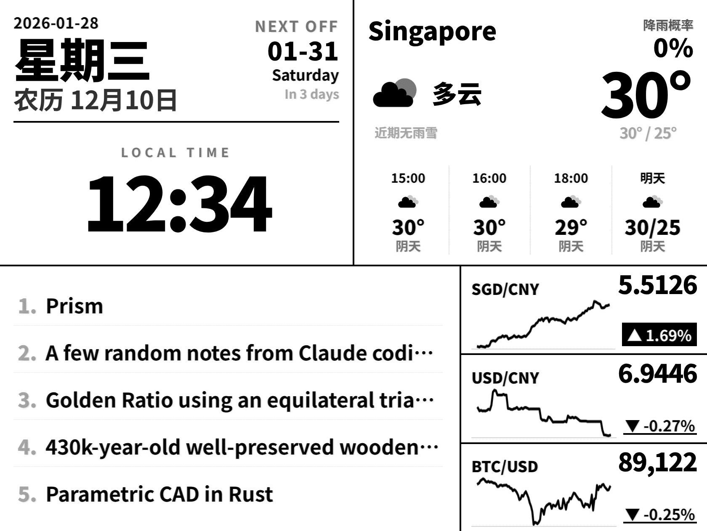

# Kindle Oasis Dashboard Server

这是一个专为 **Kindle Oasis 2** (7英寸, 1680x1264) 设计的 E-ink 仪表盘服务端程序。

它旨在配合 Kindle 上的 KUAL 扩展（或其他浏览器/截图工具）使用，提供一个高对比度、低刷新率、信息丰富且美观的 "Always-on" 桌面副屏。



## ✨ 功能特性

*   **E-ink 极致优化**: 
    *   纯黑白高对比度设计，去除灰色阶，确保在电子墨水屏上显示清晰锐利。
    *   使用粗线条和大号字体，防止抗锯齿模糊。
    *   Bento Grid 宫格布局，信息由块状分割，整洁有序。
*   **丰富的数据展示**:
    *   **新加坡天气**: 包含当前气温、湿度、降雨概率及未来数小时的天气趋势（针对新加坡优化的逻辑）。
    *   **日历信息**: 包含公历日期、星期、**农历日期**以及**新加坡法定节假日**提醒。
    *   **金融市场**: 实时追踪 SGD/CNY, USD/CNY 汇率及 Bitcoin 走势，并在服务端生成迷你趋势图 (Sparklines)。
    *   **Hacker News**: 展示 Top 5 热门科技新闻，自动截断标题以适应排版。
*   **服务端自动化渲染**:
    *   **Playwright 集成**: 内置 `/render` 接口，自动通过无头浏览器渲染并捕捉 1680x1264 图像。
    *   **高质量抖动算法**: 自动应用 16 色灰度量化和 **Floyd-Steinberg 抖动**，为 E-ink 屏提供最佳观感。
    *   **Docker 支持**: 一键部署，自动处理浏览器环境依赖。
    *   **CI/CD**: 集成 GitHub Actions，自动构建并发布镜像。

## 🛠 技术栈

*   **后端**: Python 3.12, Flask, uv
*   **前端**: HTML5, Tailwind CSS (CDN)
*   **渲染**: Playwright (Chromium)
*   **图像处理**: Pillow (Floyd-Steinberg Dithering)
*   **数据源**:
    *   `yfinance`: 股票与汇率数据
    *   `lunardate`: 农历转换
    *   `holidays`: 节假日数据
    *   `matplotlib`: 生成趋势图

## 🚀 快速开始

### 使用 Docker (推荐)

```bash
docker pull ghcr.io/t0saki/kindle-dashboard-server:latest
docker run -p 5000:5000 ghcr.io/<your-username>/kindle-dashboard-server:latest
```

### 本地运行

1.  **安装 uv** (如果尚未安装): `curl -LsSf https://astral.sh/uv/install.sh | sh`
2.  **安装依赖与浏览器**:
    ```bash
    uv sync
    uv run playwright install chromium --with-deps
    ```
3.  **运行服务**:
    ```bash
    uv run app.py
    ```

## 🔌 API 接口

*   `GET /dashboard`: 返回响应式网页版的仪表盘。
*   `GET /render`: 返回 **Kindle 优化版 (1680x1264, 16级灰度, 抖动处理)** 的 PNG 图片。这是 Kindle 客户端最常用的接口。

## 📱 Kindle 端设置 (简述)

1.  确保 Kindle 已越狱并安装 KUAL。
2.  使用脚本定期从 `http://<server-ip>:5000/render` 下载图片。
3.  使用 `eips -g /path/to/downloaded.png` 将图片显示在屏幕上。
4.  利用 Kindle 的局部刷新功能在预留区域（如时间区）快速更新，以达到省电效果。

## 📄 许可证

MIT License
